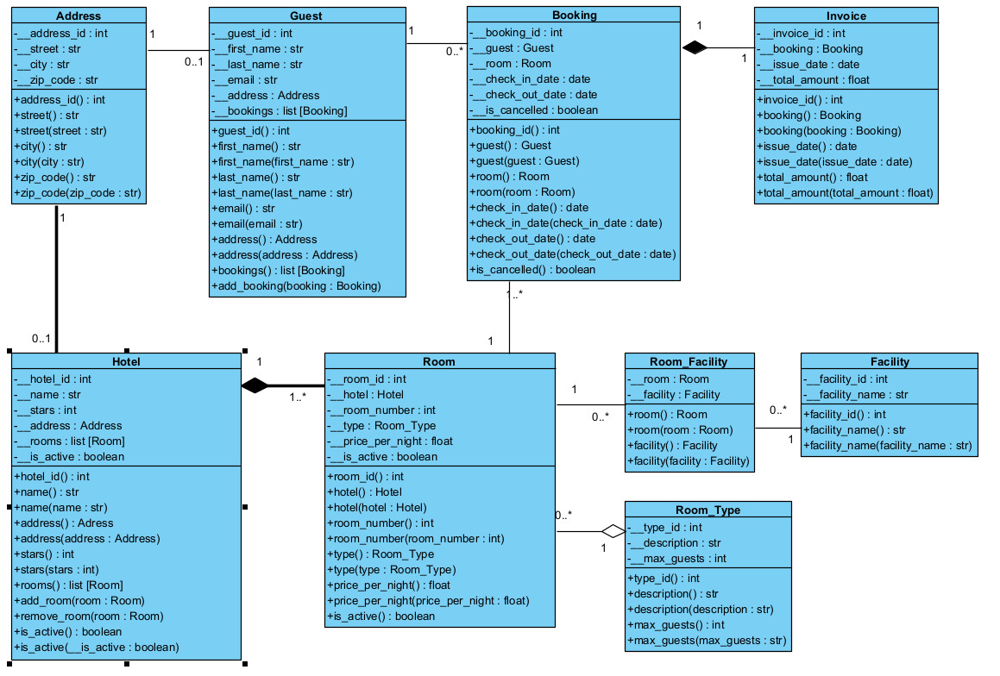

# Team-B6-Repo  
This is the repository of **Team B6**  
Module Application Development with Python  
Akishan Arichchandran  
Nils Strehle  
Noah Rolli  
Thiemo Frei  
Fachhochschule Nordwestschweiz  
Business Artificial Intelligence  

## SCRUM Project Management:  
https://github.com/orgs/AEP-Team-B6/projects/1  

## Link to Deepnote Documentation  
https://deepnote.com/workspace/DBUA-Team-C-c18e3c8f-25c5-4be0-bb77-bb8f6a66300d/project/AEP-B6-9cb1cc5b-60cb-4063-9234-00e840489c38/notebook/AEP-B6-a186cbbb02284c55b13524202bbe26ed?utm_content=9cb1cc5b-60cb-4063-9234-00e840489c38  

## Rollen der Projektmitglieder
### Thiemo Frei:
* Aufsetzen von Github
* Aufsetzen der Projektstruktur
* Implementierung Github in Deepnote
* Implementierung aller Importe im Deepnote und in Main
* Erstellen des Projekt-Boards und der Iterationen
* Erstellen und Verwalten der Tasks
* Unterstützen der Teammitglieder bei Fragen zu VS-Code, OOP und US
* Implementierung US 1.1-1.5, 2.1, 2.2, DB 2, DB 2.1, 7, Vis 1
* Erweitern der Datenbank mit weiteren Instanzen für besseres Testing
* Aufsetzen der Dokumentationsstruktur

### Nils Strehle
* 
* 
* 

### Akishan Arichchandran 
* 
* 
* 

### Noah Rolli
* US 3.1, 3.2; 3.3 zu 10 hinzugefügt  
* Dokumentation Deepnote
* README

## Projekt Struktur
Dieses Projekt folgt einer mehrschichtigen Architektur, bei der jede Schicht (Layer) eine klar abgegrenzte Aufgabe erfüllt. Dadurch wird das System übersichtlich, wartbar und leicht erweiterbar. Im Folgenden wird jede Schicht erläutert:

### .model
Der model-Layer enthält die zentralen Datenstrukturen (z. B. Hotel, Room, Address). Diese Klassen definieren, welche Eigenschaften ein Objekt besitzt und dienen als gemeinsame Schnittstelle zwischen Datenbank, Logik und UI. Sie ermöglichen eine strukturierte und typisierte Datenverarbeitung. Durch die Trennung von Struktur und Verarbeitung bleibt der Code übersichtlich.

### .database
Dieser Layer ist für die technische Anbindung der Datenbank zuständig. Hier befinden sich Konfigurationsdateien und Methoden zur Initialisierung der Verbindung. Auch die Datenbankengine oder -pfade sind hier definiert. Diese Schicht liegt direkt an der Datenquelle und wird vom data_access-Layer genutzt. Die Datei __init__.py macht das Verzeichnis als Modul importierbar.

### .data_access
Der data_access-Layer kümmert sich um den konkreten Zugriff auf Datenobjekte: Hotels lesen, Adressen erstellen, Buchungen löschen usw. Er nutzt die Modelle aus dem model-Layer und arbeitet mit dem database-Layer zusammen. Hier wird definiert, wie Daten gelesen, geschrieben oder gelöscht werden. Damit trennt er sauber technische Datenoperationen von fachlicher Logik.

### .business_logic
Hier befindet sich die fachliche Logik des Systems. Der business_logic-Layer enthält Regeln und Prozesse – z. B. ob ein Hotel gelöscht werden darf oder wie Buchungspreise berechnet werden. Er nutzt den data_access-Layer, um mit den Daten zu arbeiten, und wird wiederum von der Benutzeroberfläche angesprochen. So ist gewährleistet, dass alle zentralen Regeln an einem Ort gebündelt sind.

### .ui
Die ui-Schicht stellt die Benutzerschnittstelle dar – in diesem Fall über die Konsole. Hier werden Eingaben entgegengenommen und Ausgaben dargestellt. Mithilfe von input_helper.py wird eine saubere und sichere Eingabevalidierung ermöglicht. Die ui kommuniziert direkt mit der business_logic, um Aktionen auszuführen. Die Datei __init__.py macht das UI-Paket importierbar.

### main.py
Die Datei main.py dient als Startpunkt der Anwendung. Sie koordiniert den Programmablauf, ruft Funktionen aus der UI auf und sorgt dafür, dass das System korrekt gestartet wird. main.py gehört nicht zur UI, sondern fungiert als Controller und zentrale Steuerstelle. Somit ist die Platzierung ausserhalb des .ui

## Anwendung von KISS
was ist KISS? wie wurde es angewendet? und wo könnten wir es noch anwenden?

## Anwendung von DRY
was ist DRY? wie wurde es angewendet? und wo könnten wir es noch anwenden?

## Klassendiagram

 

Address
Funktion: Repräsentiert die Adresse eines Hotels oder Gastes.
Attribute: Straße, PLZ, Stadt, ID.
Getter/Setter: vorhanden z. B. street(), zip_code(), city().
Besonderheit: Wird als eigene Klasse eingebunden, um Redundanz zu vermeiden (1:n-Beziehung zu Hotel und Guest)

Guest
Funktion: Enthält persönliche Daten eines Gasts und referenzierte Buchungen.
Wichtige Attribute: first_name, last_name, email, address
Getter/Setter: vorhanden für alle Attribute.
Besonderheit: Enthält eine Liste von Buchungen (bookings).

Booking
Funktion: Beschreibt eine einzelne Buchung zwischen Gast und Zimmer.
Wichtige Attribute: check_in_date, check_out_date, is_cancelled
Getter/Setter: vorhanden.
Besonderheit: Enthält zusätzlich das Attribut is_cancelled zur Stornierungskennzeichnung.

Invoice
Funktion: Repräsentiert die Rechnung zu einer Buchung.
Wichtige Attribute: issue_date, total_amount
Getter/Setter: vorhanden, z. B. total_amount()
Besonderheit: 1:1-Verknüpfung mit einer Buchung.

Hotel
Funktion: Repräsentiert ein Hotel mit Name, Adresse und Zimmern.
Wichtige Attribute: name, stars, address, is_active
Getter/Setter: vollständig vorhanden.
Abweichung:
    is_active: ermöglicht Deaktivierung ohne Löschen
    Referenziert Liste von Room-Objekten
    Bereit für Erweiterung durch neue Klasse Review

Room
Funktion: Beschreibt ein konkretes Zimmer eines Hotels.
Wichtige Attribute: room_number, price_per_night, price_per_night_ls, type, is_active
Getter/Setter: vorhanden.
Abweichung:
    price_per_night_ls wurde hinzugefügt (z. B. für Nebensaisonpreise)
    is_active ermöglicht das Deaktivieren einzelner Zimmer

Room_Facility
Funktion: Verknüpfungstabelle zwischen Room und Facility (n:m-Beziehung).
Wichtige Attribute: room, facility
Getter/Setter: vorhanden.
Besonderheit: Ermöglicht flexible Zuordnung beliebiger Ausstattungen pro Zimmer.

Facility
Funktion: Repräsentiert eine Ausstattung wie WLAN, TV etc.
Wichtige Attribute: facility_name
Getter/Setter: vorhanden.
Besonderheit: Wird über Room_Facility zugeordnet.

Room_Type
Funktion: Definiert Zimmerkategorien (Einzelzimmer, Suite etc.).
Wichtige Attribute: description, max_guests
Getter/Setter: vorhanden.
Besonderheit: Wird als Fremdschlüssel in Room verwendet.

Review (neu hinzugefügt)
Funktion: Repräsentiert Bewertungen durch Gäste für Hotels oder Zimmer.
Getter/Setter: analog zu anderen Klassen.

Weitere Abweichungen & Ergänzungen
price_per_night_ls in Room: Zweiter Preis für Nebensaison/Sondertarife
Review-Klasse: Neue Entität zur Qualitätsbewertung
Testinstanzen: Zusätzliche Datensätze zum manuellen oder automatisierten Test

Hinweis zu Getter/Setter:
Alle Klassen verwenden klassische Getter- und Setter-Methoden zur sicheren Kapselung von Attributen, z. B. get_name(), set_name(name: str), wie im OOP-Stil üblich.

## Projektmanagement und Planung
Unser Projekt wurde nach der agilen Methodik SCRUM organisiert. Ziel war es, das Hotelbuchungssystem schrittweise in funktionalen Inkrementen zu entwickeln, mit regelmäßiger Abstimmung im Team. Dabei haben wir bewusst auf iteratives Arbeiten und kurze Kommunikationswege gesetzt.

Zur Aufgabenplanung und Fortschrittsverfolgung haben wir das GitHub Project Board genutzt. Alle Aufgaben wurden dort in Form von Issues und Cards gepflegt, priorisiert und einzelnen Teammitgliedern zugewiesen.
Wir haben darauf geachtet, nach jedem abgeschlossenen Codeblock regelmäßig zu committen, um die Nachvollziehbarkeit und Versionskontrolle zu gewährleisten.

Die Codequalität wurde durch Code Reviews und manuelle sowie automatische Tests sichergestellt. Vor der Integration größerer Features wurde der Code von anderen Teammitgliedern geprüft, wodurch Fehler frühzeitig erkannt und beseitigt werden konnten.

Obwohl wir nach dem SCRUM-Vorgehen gearbeitet haben, konnten wir aufgrund des engen Zeitrahmens keine vollständigen Sprint-Zyklen mit schriftlichen Retrospektiven durchführen. Stattdessen fanden regelmäßige Abgleichsmeetings statt, in denen wir Aufgaben abgestimmt, Probleme diskutiert und Anpassungen vorgenommen haben.

Diese agile, pragmatische Vorgehensweise hat es uns ermöglicht, das Projekt fokussiert, kollaborativ und flexibel umzusetzen.

## Fazit
### Was haben wir gelernt?
zusammenfassen was in den UE mitgeteilt wurde

### Hürden
Wir hatten Startschwierigkeiten die wir zuerst nicht wussten, wie zu überwinden. Danach wurde jedoch konsequent gearbeitet. 

### Team-Arbeit
Als Team haben wir schon im ersten Semester für das Projekt im Modul Datenbasierte Unternehmensanwendungen zusammengearbeitet. Dies hat so gut funktioniert, dass wir uns dazu entschlossen haben, so fortzufahren. 
Aufgefallen ist, dass wir es dieses Mal anfangs lockerer angegangen sind, was zu Vor- und Nachteilen führte.
Uns war nicht von Anfang an klar, wie wir das Projekt umsetzen sollten - das Wissen über Python war noch nich so stark. Somit entschieden wir uns zu Coden, zu lernen, jeder für sich selbst. Mit unterrichtsmaterialien und der Website "Codefinity".
Als wir im Unterricht zu den Klassen Atributen kamen, sahen wir unseren Startpunkt. Troz dem Wissen, dass wir bei der anwendung von Python stärkere und schwächere Mitglieder hatten war uns klar dass wir alle an den User Stories arbeiten.
Als die Zeit gegen Ende knapper wurde wendeten wir wie letztes Semester unsere bewährte Strategie an zwei Mitglieder an der Fertigstellung des Python-Teil an und zwei an der Fertigstellung der Dokumentation.

### Abschluss
Schlussendlich haben wir uns erneut bewiesen, dass wir sehr gut als Team funktionieren auch wenn wir dieses Mal eine andere Vorgehensweise hatten. Wir konnten vieles aus dem ersten Semester mitnehmen - vor allem lösungsorientiertes Arbeiten und die Erfahrung, welche Teammitglieder wo ihre Stärken und Schwächen haben und dies gewinnbringend nutzen. 

## Quellen
Welche Quellen hatten wir, und welche tools.
ChatGPT (zur Fehleranalyse, Unklarheiten)
Moodle "Anwendungsentwicklung mit Python"

## Markdown format ✨

